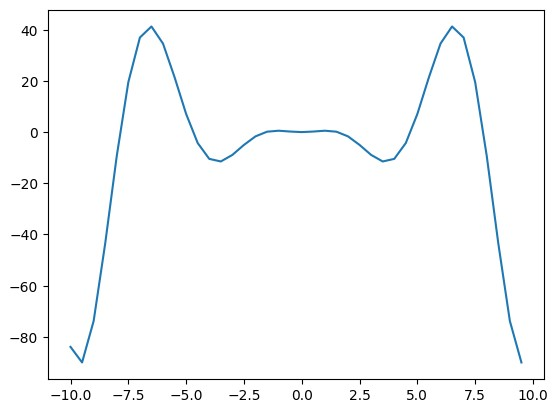
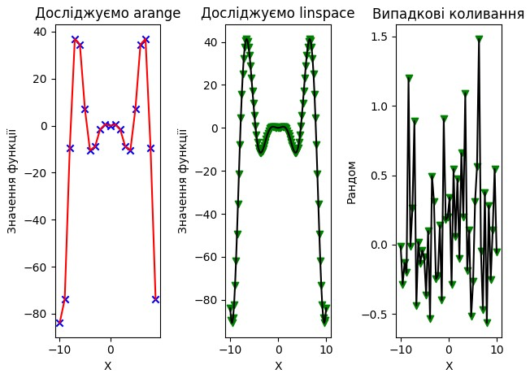
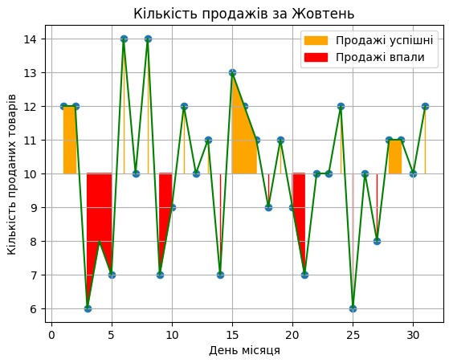
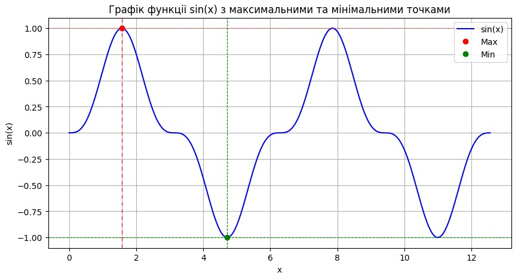
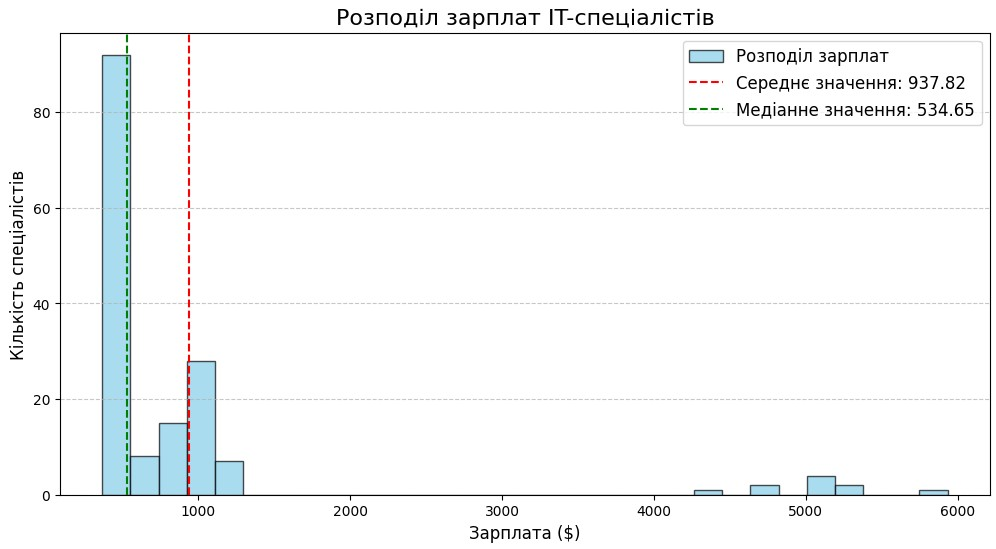
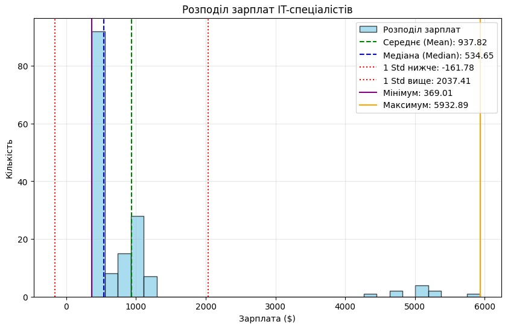
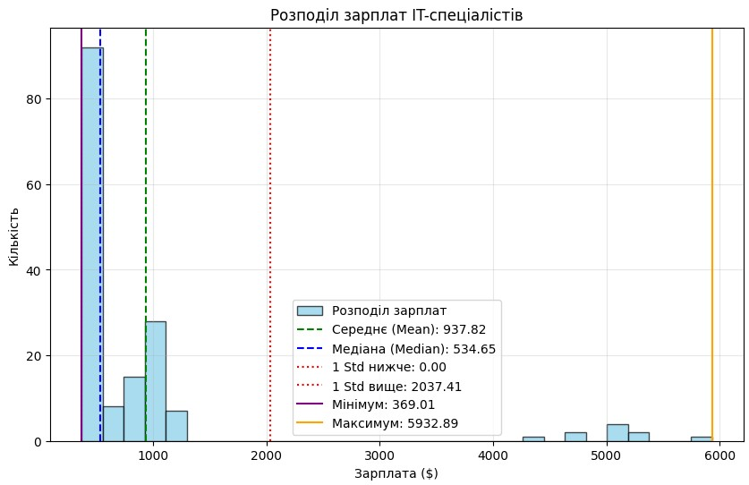
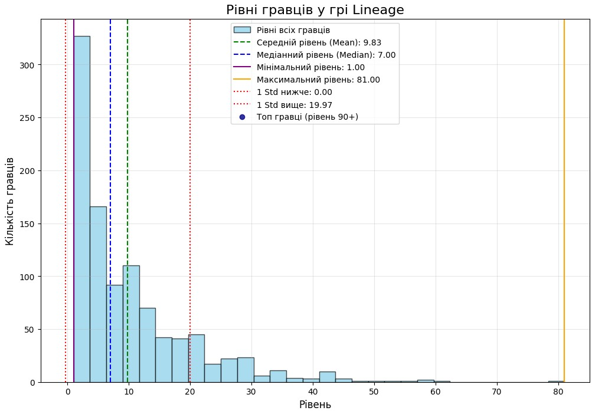
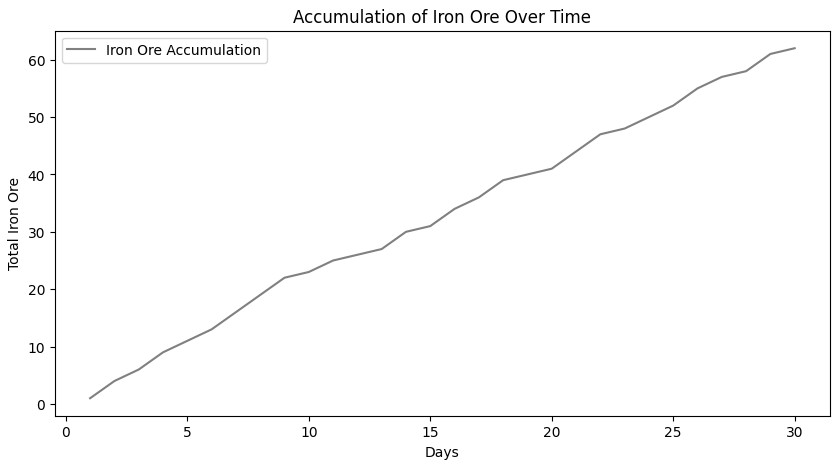
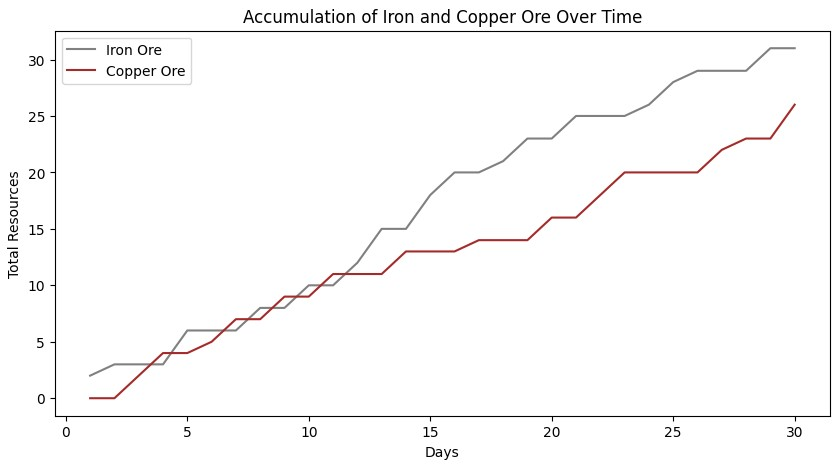

# Звіт до роботи

## Тема: Робота з числовими даними

### Мета роботи: Виконати всі завдання та приклади з завдання, лекцій і лабораторних

---

### Виконання роботи

* Результати виконання завдання:
    1. Виконано код/приклади наведені в Notebook.
    2. Модифіковано Notebook та виконано додаткові завдання (homework-и).
    3. Виконано приклади з 1.ipynb.
    4. Виконано приклади з 2.ipynb.
    5. Виконано приклади з 3.ipynb.
    6. Виконано приклади з mine.ipynb.

* Приклади коду та результати виконаної роботи представлені у репозиторії в файлах NumericalData.ipynb і TaskLecturesLaboratories.ipynb

* Графіки, отримані в результаті виконання деяких із завдань:
    ```











    ```

### Висновок:
- :question: Що зроблено в роботі - Виконано всі завдання та приклади з завдання, лекцій і лабораторних.
- :question: Чи досягнуто мети роботи - Так, повністю.
- :question: Які нові знання отримано - Те, як працювати з числовими даними на Python.
- :question: Чи вдалося відповісти на всі питання, задані в ході роботи - Так.
- :question: Чи вдалося виконати всі завдання - Так, усі homework-и виконано.
- :question: Чи виникли складності у виконанні завдання - Спочатку виникли, проте завдяки консультації від одногрупників та викладача вдалось розібратись.
- :question: Чи подобається такий формат здачі роботи (Feedback) - Так.
- :question: Побажання для покращення (Suggestions) - Нема.

---